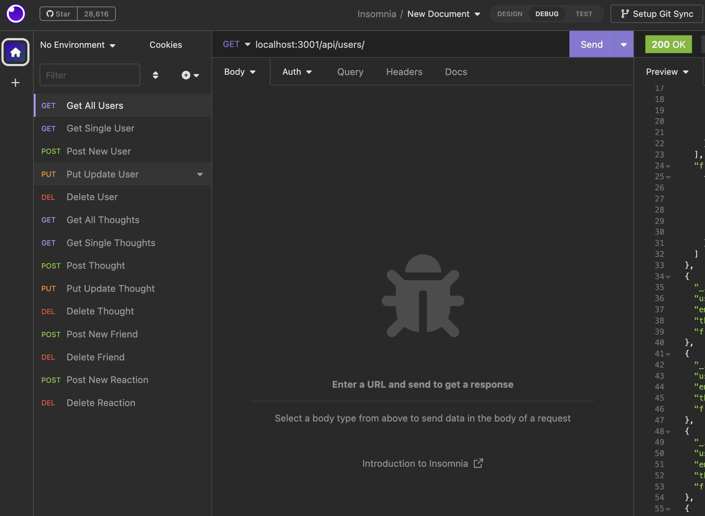

# Simple Social Media Backend

## Description

- Create a simple Mongo db based api for a scoial media site.

### Why
- To practice my mongo, node and express skills
### Problem this app solves
- The backend setup and endpoints of a social media site
### Learnings
- I learnt how to use Mongo

## Table of contents:

- [Installation](#installation)
- [Usage](#usage)
- [vdieo-demo](#video-demo)
- [Contributing](#contributing)
- [Tests](#tests)
- [License](#license)
- [Questions](#questions)

## Installation

- Code editor (e.g. Visual Studio Code) Modern web browser (e.g. Google Chrome, Mozilla Firefox)

## Usage

Open in code editor install the npm packages, seed the db in using the example usernames in the utils folder them node index.js

### Screenshot 

### Video-demo

https://drive.google.com/file/d/1KCXriHsR__qens5w9TMx3oJVARJuPcXy/view

## Contributing

### To contribute to our project, please follow these steps:

- Fork the repository and create a new branch for your changes.
- Make your changes and commit them to your branch.
- Push your changes to your forked repository.
- Submit a pull request to our repository.
- Please provide a clear and descriptive title for your pull request, along with a detailed description of the changes you have made. We also ask that you include any relevant tests or documentation updates with your changes.

## Tests

undefined

## License

This project is licensed under the mit license.

## Questions

If you have any questions or feedback on the project, feel free to reach out to me at:

- Email: ashalala93@gmail.com
- GitHub: https://github.com/supershalala

